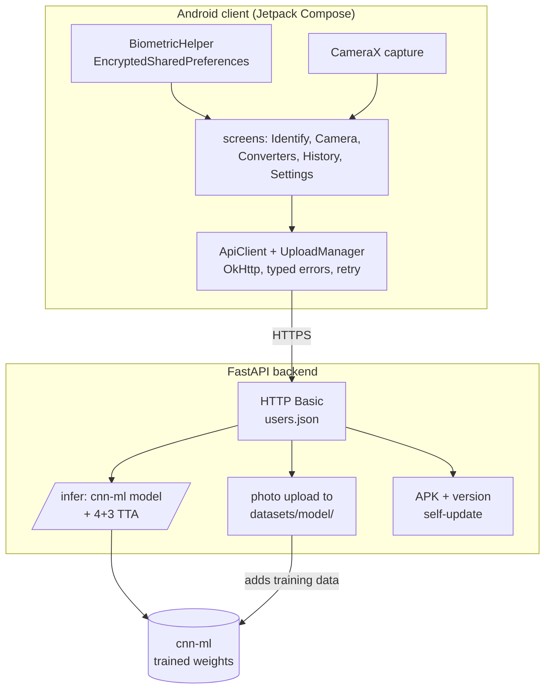

# cnn

[](https://kotlinlang.org/)
[](https://developer.android.com/jetpack/compose)
[](https://fastapi.tiangolo.com/)
[](LICENSE)

> Identifies an automotive torque-converter / CVT model from a phone photo. A Jetpack Compose Android client captures the image; a FastAPI + PyTorch backend runs the [cnn-ml](https://github.com/leobaray/cnn-ml) model and returns the model with a confidence score. The same app also collects labeled photos for the training set.

---

## Why this exists

Field identification of torque-converter and CVT models relies on stamped codes that wear off or on paper catalogs, and several models look alike. The app sends one photo to the backend and shows the model and confidence. Every photo a user takes is a labeled sample, so the app also feeds the [cnn-ml](https://github.com/leobaray/cnn-ml) training set.

---

## Features

- Identification: log in, open the camera, take a photo. It is sent to `/infer`, which runs the model with test-time augmentation and returns the model and confidence.
- Biometric login (`androidx.biometric`); credentials kept in `EncryptedSharedPreferences` (`security-crypto`).
- Collection mode: photos are saved into per-model folders on the server. An on-device photo-count cache persists between sessions.
- In-app updates: the server hosts the signed APK and a version code; the app installs updates over `REQUEST_INSTALL_PACKAGES` + `FileProvider`.
- Uploads: `UploadManager` separates permanent from transient failures, retries with a cap, reports X-of-Y progress, and can cancel.
- Identification history, converter/filter browsing, image caching (Coil plus a thumbnail cache), and a Compose UI with skeleton loaders and dark/light themes.

---

## Technical notes

- Kotlin 2.2.10, Jetpack Compose BOM 2024.09.00 (Material 3), AGP 9.1.1, `minSdk 33`, `targetSdk 36`, `versionName 7.1`. CameraX 1.3.4, Coil 2.6, OkHttp 4.12.
- `ApiClient` exposes a typed `ApiError` hierarchy with Portuguese messages; `UploadManager` adds retry and progress on top.
- Backend: FastAPI + uvicorn. `/infer` lazy-loads the [cnn-ml](https://github.com/leobaray/cnn-ml) model from a sibling checkout and runs the same 4-flip + 3-rotation TTA as training. Auth is HTTP Basic against a gitignored `users.json`.
- Image type is detected by magic bytes (jpg/png/webp/bmp signatures), replacing the `imghdr` module removed from the standard library in Python 3.13.
- Signing keys come from a gitignored `keystore.properties`; the signing block is skipped when it is absent, so CI can `assembleDebug`. See [`SECURITY.md`](SECURITY.md).

---

## Architecture



---

## Engineering decisions

### Server-side inference

The model and its TTA are GPU-bound, and the weights are retrained on their own cadence. Running inference on the server means every client uses the current model without an app update.

### FastAPI here, no framework in epi_system

[epi_system](https://github.com/leobaray/epi_system) is one stdlib process on a LAN PC with no ML, so a framework would add nothing there. This backend handles multipart image uploads and sits next to a PyTorch stack, where FastAPI's upload parsing and validation are used.

### Collection in the same app

Identification and collection both produce a photo. Folding collection in lets a field correction become a labeled sample for [cnn-ml](https://github.com/leobaray/cnn-ml) without a separate workflow.

### In-app updates

Distribution is to a known set of internal devices, so the server hosts the signed APK behind the same auth instead of the Play Store. The cost is owning the update path (version check + `FileProvider` install).

### Biometric + EncryptedSharedPreferences

Devices are shared. A biometric gate over credentials in `EncryptedSharedPreferences` avoids re-typing the login and keeps it off disk in plaintext.

---

## Tech stack

| Layer | Choice | Notes |
|-------|--------|-------|
| Client | Kotlin 2.2.10, Jetpack Compose (Material 3) | `minSdk 33`, `targetSdk 36`, AGP 9.1.1 |
| Camera | CameraX 1.3.4 | capture + preview |
| Networking | OkHttp 4.12 | typed `ApiError`, retrying `UploadManager` |
| Images | Coil 2.6 + thumbnail cache | |
| Security | `security-crypto`, `androidx.biometric` | EncryptedSharedPreferences |
| Backend | FastAPI + uvicorn | `/infer`, upload, APK self-update |
| Model | PyTorch + torchvision via [cnn-ml](https://github.com/leobaray/cnn-ml) | same TTA as training |

---

## Project structure

```
cnn/
├── apk/                          # Android app (Gradle, Kotlin, Compose)
│   └── app/src/main/java/com/lbwma/cnn/
│       ├── MainActivity.kt
│       ├── BiometricHelper.kt
│       ├── screen/               # Identify, Camera, Converters, Photos, Review, Settings, Login
│       ├── network/              # ApiClient, UploadManager, AppUpdater, ThumbnailCache
│       ├── model/                # Filtro, IdentificationHistory, PhotoCountCache, RefinementStore
│       └── ui/                   # Design.kt, Skeleton.kt, theme/
├── server/
│   ├── server.py                 # FastAPI: /infer, photo upload, APK + version
│   └── requirements.txt
├── SECURITY.md
└── LICENSE
```

Not committed: `server/users.json`, `apk/keystore.properties`, and the keystore. All gitignored, supplied per environment.

---

## Getting started

### Backend

```bash
cd server
python -m venv .venv && . .venv/Scripts/activate   # .venv/bin/activate on Linux/macOS
pip install -r requirements.txt

# Credentials (gitignored): { "username": "password", ... }
echo '{ "admin": "changeme" }' > users.json

uvicorn server:app --host 0.0.0.0 --port 8000
```

`/infer` expects a sibling [cnn-ml](https://github.com/leobaray/cnn-ml) checkout for the weights.

### Android app

Open `apk/` in Android Studio and run, or install a release APK. Point the app at the backend URL and log in.

---

## Scale

In production use. The backend classifies 180 torque-converter models trained on ~4,400 images per class (~792k images total). Median end-to-end identification (capture, authenticated upload, inference with TTA, response) is ~2.36 s on an RTX 5070 Ti; latency depends on the server GPU and network.

---

## What I'd do differently

- Replace HTTP Basic with token auth and require TLS. Basic over the wire is fine on a controlled network but not the long-term posture.
- Add tests. The Android module has only the generated example stubs and the backend has none; the upload retry logic and the `/infer` path are first to cover.
- Split the backend's two jobs. `server.py` serves inference and manages collection; those are separate concerns and should be separate services.
- Add CI to build the APK and run backend tests on each push.

---

## Related projects

- [cnn-ml](https://github.com/leobaray/cnn-ml) — the PyTorch training pipeline that produces the model this app serves.
- [epi_system](https://github.com/leobaray/epi_system) — industrial PPE manager, NR-6 / eSocial compliant, single stdlib Python process.

---

## Contact

Leonardo Baray Machado, Curitiba, Brazil. Open to remote engineering roles.

- GitHub: [@leobaray](https://github.com/leobaray)
- Email: leonardobaray@outlook.com

---

Licensed under the MIT License — see [LICENSE](LICENSE).
